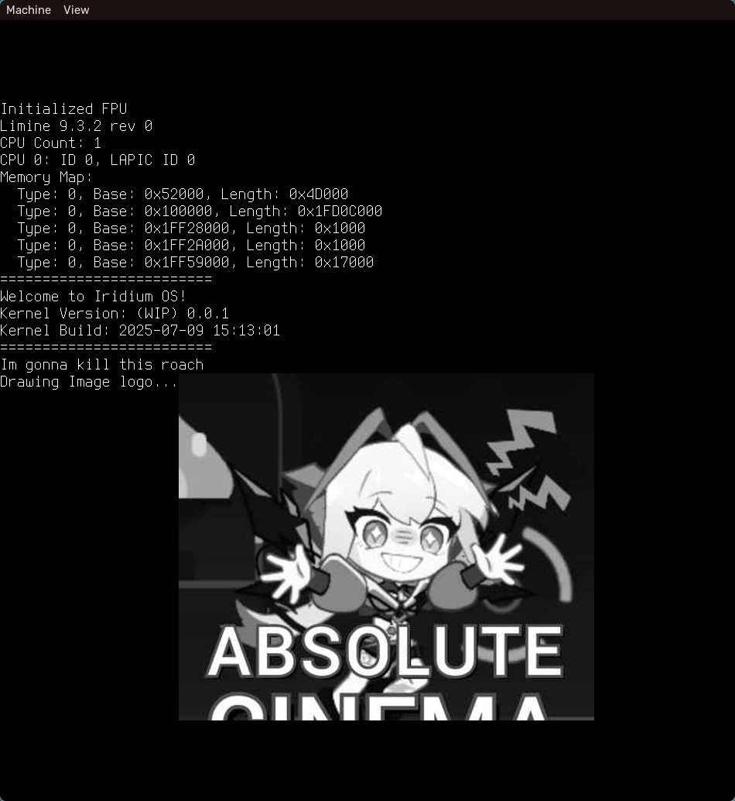
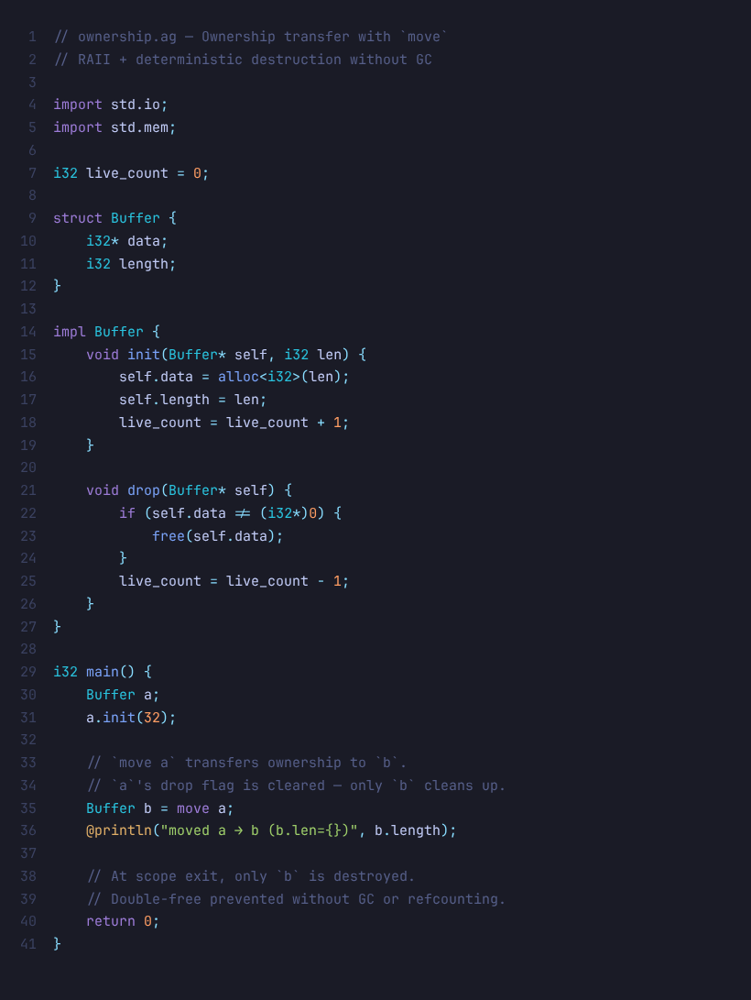
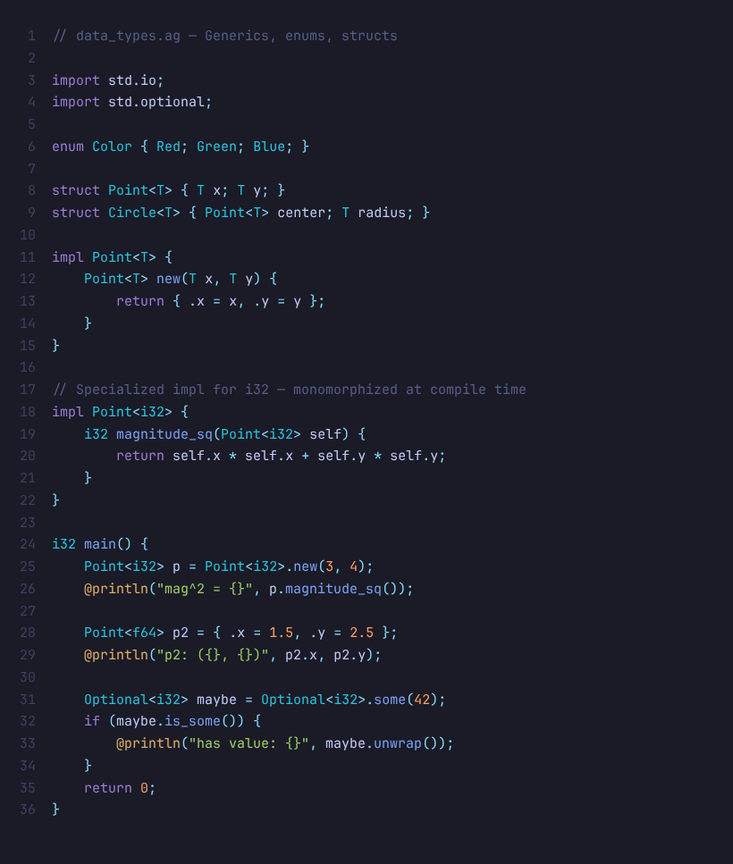
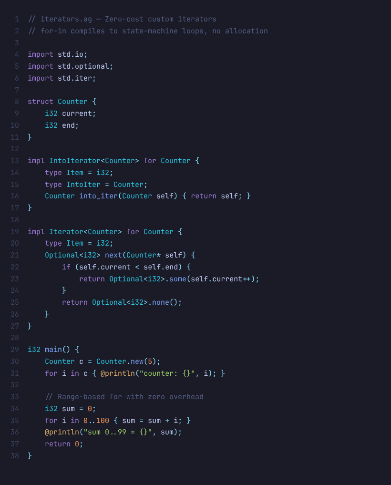

<h1 align="center">Aabish Malik</h1>

<em>Systems programmer</em>

  
  

---

## About

Currently building: Something Weird (Just hope this one doesnt end up in a ditch)

  

---

## Projects

### [Silver](https://github.com/CierCier/silver) — An Experimental Systems Programming Language

A statically-typed systems language built on LLVM with deterministic destruction, zero-cost iterators, first-class RAII, and a module system with packaged compilation. The compiler (`agc`) implements parsing, semantic analysis, type checking, and codegen — all from a single self-hosted pipeline.

<table>
<tr>
<td width="33%"></td>
<td width="33%"></td>
<td width="33%"></td>
</tr>
</table>

> **Mutable by default, `const` for immutability** &middot; **Deterministic destruction** &middot; **`move` ownership transfer** &middot; **Generics with monomorphization** &middot; **Zero-cost `for`-in iterators** &middot; **LLVM native codegen**

  
  
  

---

### [tori](https://github.com/CierCier/tori) — OS Kernel

A rendition of the iridium kernel project. Low-level systems work at the hardware-software boundary.

  
  

---

### [fbs-core](https://github.com/i-got-this-faa/fbs-core) — Fast Blob Storage

An S3-compatible blob storage and CDN solution built for self-hosting. High-throughput object storage with a clean API surface.

  
  
  
  

---

## Tech

**Languages**

  
  
  
  
  
  

**Frontend**

  
  
  
  

**Backend**

  
  

**Other**

  
  
  
  
  

---

## Stats

  

  

  

---

## Contact

Open an issue or discussion on any repo.

---

### Look at this Suisei

  

