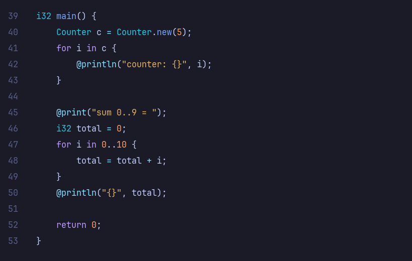
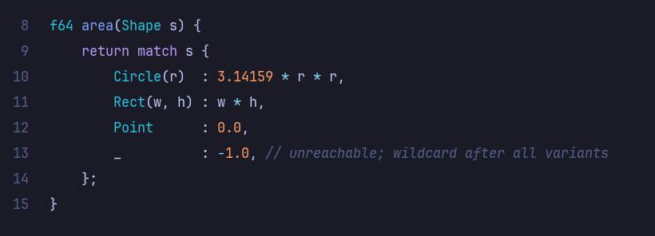
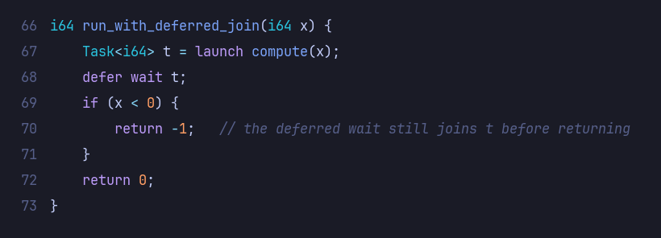
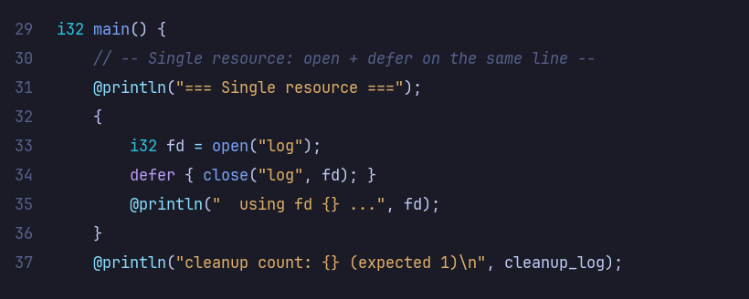
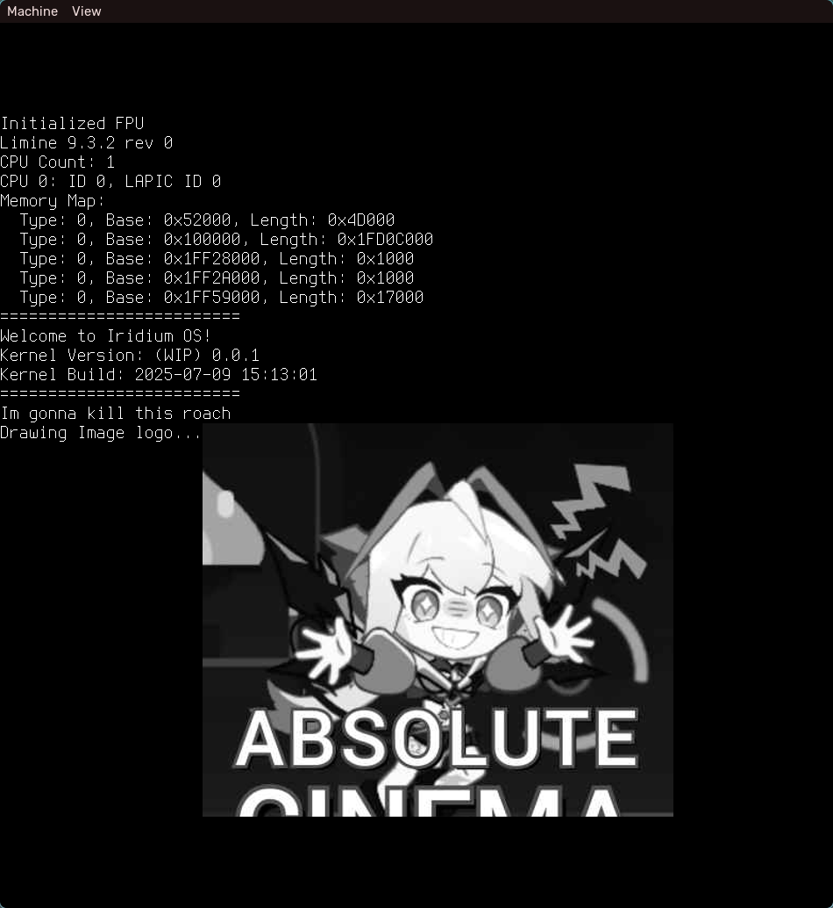

# Aabish Malik

Systems programmer. I work on the boring stuff, so you don't have to.

## Projects

### [Silver](https://github.com/CierCier/silver)

General-purpose programming language for some of us.

<table>
<tr>
<td width="50%"> Builtin zero-cost iterators</td>
<td width="50%"> Match statements for better ergonomics</td>
</tr>
<tr>
<td width="50%"> Threading shouldn't feel like an afterthought</td>
<td width="50%"> Defers are useful, why not?</td>
</tr>
</table>

WIP self-hosted, LLVM for codegen. MIT licensed.

---

### [tori](https://github.com/CierCier/tori)

Experimental small OS kernel with fair scheduling.

  

Boots, runs, learnt more about OS internals than college.

Written in C++.

---

### [fbs-core](https://github.com/i-got-this-faa/fbs-core)

S3-compliant blob storage. Use it to test in development, host a file-share service, or send memes to your friends. It's boring, because what you can do is the real fun.

Written in Go.

---

## Tools

Gets the work done, I don't really mind anything.
Proficient in Rust, Python, Go and TypeScript.

---

## Contact

The easiest way is to open an issue or discussion on whichever repo is relevant. I'm also on X as [@CryN_01](https://x.com/CryN_01).

---

   
  <em>Suisei says hi.</em>

